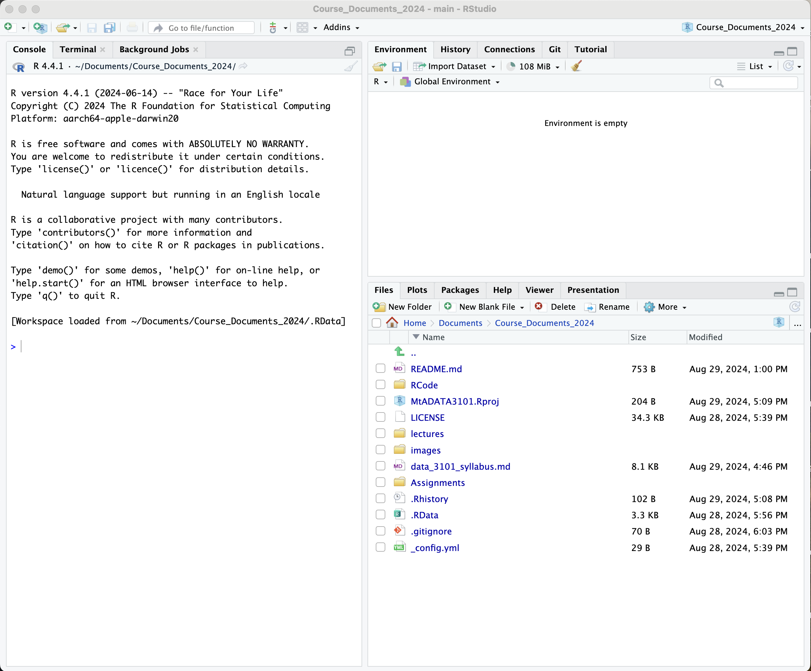

## Why use R?

-   Widely used in Open Science to write and share reproducible code
-   Also used in DATA 3001 Data Visualization and Communication
-   A good challenge for Computer Science students in this interdisciplinary course - the more tools you know, the better! You can then evaluate which suits your needs more.

## R Tour

When you open R, it will have 3 areas:

-   Console / Terminal: You can run code in the console. For example, installing packages is usually done in the console.

-   Environment / History / Connections / Git / Tutorial pane: This is where you can see the objects you've created and commit your files to GitHub.

-   Files / Plot / Packages / Help / Viewer / Presentation pane: Navigate your files and find help and documentation.

**Check-in question**: What version of R is running on your computer?

Please let me know if you ever have problems reading the code in class. I can easily zoom in.

Zooming in and out is done with keyboard shortcuts:

-   Zoom in: Cmd/Ctrl +

-   Zoom out: Cmd/Ctrl -

## Using R like a Calculator

- Test arithmetic and order of operations
  - Parentheses: ()
  - Exponents: ^ or **
  - Multiply: *
  - Divide: /
  - Add: +
  - Subtract: -
- Cancel an incomplete command by hitting Esc in the Console window

**Check-in question**: How does R indicate that is ready for the next command?

## R Script files and RNotebook Files

For reproducibility, you'll usually want an R script file (file extension .R) or an R notebook (file extension: .Rmd). Most of my class content will be R notebooks because they are the easiest way to combine markup text with code. I set the output of my file to github_document to create .md files that can be easily read in GitHub.

# Today: Compare R Script files and RNotebook files

Go to File -> New File -> R Script and create a new R Script file. Save it as DATA_3101_test_script.R

Go to File -> New File -> R Notebook and create a new R Notebook. Save it as DATA_3101_test_notebook.Rmd

