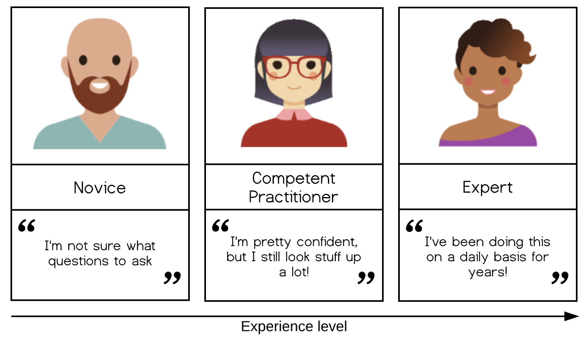

## Learning objectives

At the end of the course, students are expected to be able to:

-   Demonstrate in depth understanding of the principles, motivations and goals for reproducible, ethical, and open data

-   Use Git for communication and reproducible version control

-   Import and tidy diverse data sources across platforms

-   Explore data to identify potential research questions or problems in the dataset

-   Identify best practices for research data management, including data organization, storage, security, sharing, and ethical re-use

-   Demonstrate what they have learned about data acquisition, data organization, and data tools through self-reflection

## Research Data

## Data Science

We'll be focusing on importing, tidying, and transforming data in this class. Consider taking DATA 3001 (Data Visualization and Communication) with Dr. Riley to complete the process.

## Tools: Git & RStudio

-   One of the themes throughout this course is the importance of reproducibility and open data
-   RStudio: import, tidy, analyze, and communicate data using a reproducible workflow
-   RStudio can be linked with Git for version control
-   Many of the good practices in research data management can be demonstrated using these tools (importance of file naming, file structures, documentation, version control)

## Practice and Learning

-   Approximately half of our class time will be participatory live coding and problem solving.

## CEWIL Project

-   CEWIL = Co-operative Education and Work-Integrated Learning
-   We will be working on a data project to support Open Access publications
-   We will acquire the data through webscraping and transform it to meet the requirements of the Open Journal Systems' import plugin
-   We will use both R and Artificial Intelligence text analysis approaches
-   You will have access to ChatGPT Team (data analysis, file uploads, web browsing) supported through the CEWIL grant
-   You will receive a stipend

## Ungrading

-   My focus is on learning and interaction
-   Submit - get feedback - improve & resubmit
-   Tracking engagement, contributions, and progress
-   Self-evaluation

Q: Have you had any experiences with ungrading?

## To Do List - In Class

1.  Register a [GitHub account](https://github.com/)

A few username tips: - Include part of your name - this makes it easier for people to know who you are and trust you! - Don't highlight your current university or employer (for me, this would have led to problems: estregger-mcmaster, estregger-umanitoba, estregger-rrc, estregger-usask, estregger-uwo, estregger-mta ??? UGH) - Use all lowercase letters

2.  Complete the Student Information Survey in Moodle

I will need your GitHub username to invite you to the course organization and student team and to set up your private repository for assignments. Information about your major, coding background, and learning goals helps me choose examples and support you.

## To Do List - This Week

-   Read the syllabus
-   Reading: Bryan, J. (2018). Excuse Me, Do You Have a Moment to Talk About Version Control? *The American Statistician*, *72*(1), 20–27. <https://doi.org/10.1080/00031305.2017.1399928>

Pro tip: if you're reading articles off campus, check out the [MTA Libraries Off-Campus Bookmarklet](https://libraryguides.mta.ca/research_help/research_tips/how_do_i) to get access to electronic resources.

## References

Condon, P., Bresnahan, M., & Opuda, E. (2022, January 1). Visual Representation of the Research Process, a Lifecycle Model. <https://scholars.unh.edu/faculty_pubs/1454>

The Carpentries. (2024). Building skill with practice. The Carpentries Instructor Training. <https://carpentries.github.io/instructor-training/02-practice-learning.html>

Wickham, H., Çetinkaya-Rundel, M., & Grolemund, G. (2023). Introduction. In R for Data Science (2nd ed.). <https://r4ds.hadley.nz/intro>
